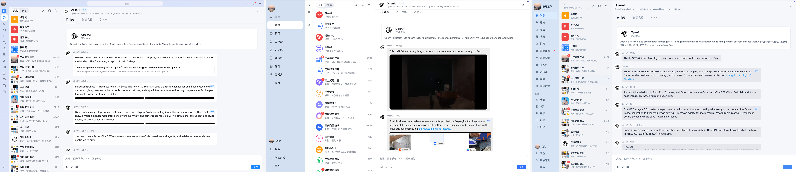
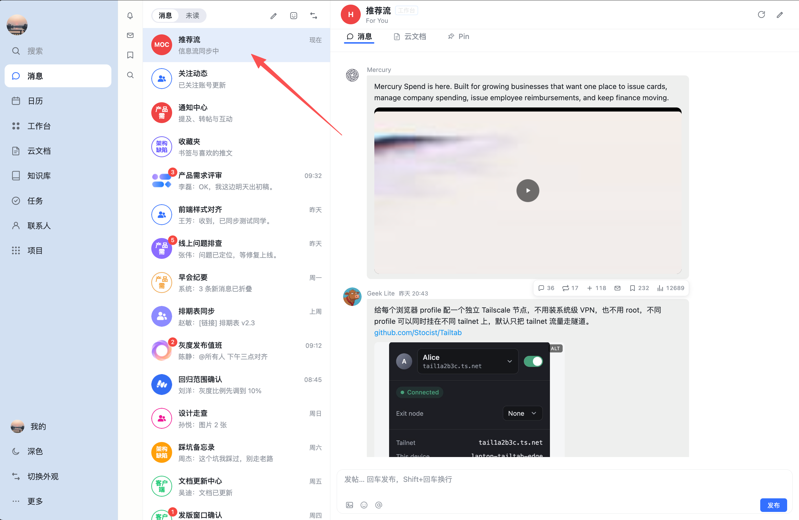
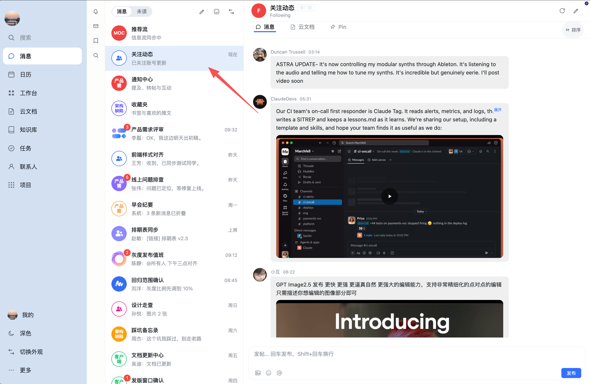
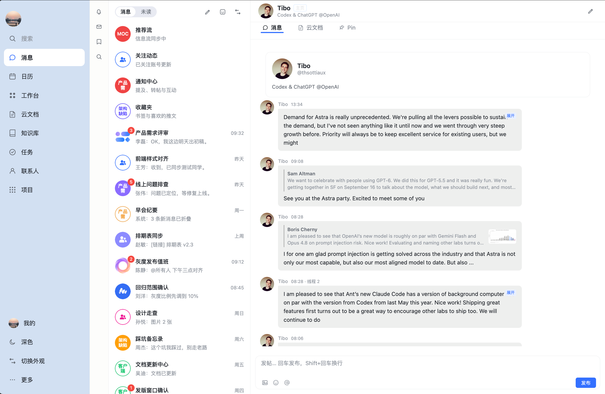
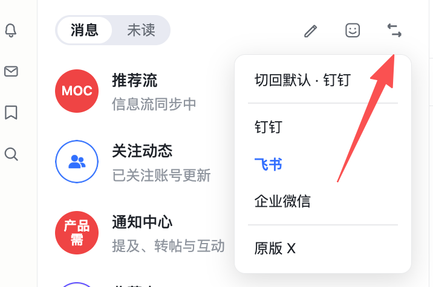

# X (Twitter) · IM 三合一伪装外观（x-im.user.js）

一套油猴脚本，将 [x.com](https://x.com/) / [twitter.com](https://twitter.com/) 的网页信息流深度伪装成 **钉钉 PC 端**、**飞书 IM** 或 **企业微信**办公聊天界面。

**只换皮，不碰隐私与凭证**：推文自动投影为聊天消息气泡，点赞、转推、发帖全部走官方原生前端 React 运行时触发，安全无风控风险。

---

## 效果预览

### 1. 三合一风格全览（钉钉 / 飞书 / 企业微信）
> 一套脚本集成三款主流企业办公界面，中栏顶部一键随意切换



---

> 下方以 **飞书风格** 为例展示主要功能界面：

### 2. 推荐流（For You）· 飞书风格
> 主页推荐时间线按聊天消息气泡实时呈现，支持多图、转推标记与原画视频预览



### 3. 关注流（Following）· 飞书风格
> 关注账号动态专栏，支持热门 / 最新排序切换，无缝跟随关注博主推文更新



### 4. 推文详情与树状评论区（抽屉展开）· 飞书风格
> 点击推文从中栏右侧平滑抽出详情抽屉，展示完整长推、引用帖与多级回复树；主页时间线完全冻结不丢失


### 5. 个人主页（Profile）· 飞书风格
> 用户个人主页呈现为联系人私聊界面，顶栏直接显示博主简介、认证标识与专属动作栏



---

## 核心功能

### 1. 快捷控制：三套皮肤切换与一键防窥
中栏顶部常驻外观切换与防窥脱敏菜单，偏好自动本地记忆：

| 外观切换菜单 | 一键防窥脱敏 |
| :---: | :---: |
|  |  |
| *随时切换钉钉 / 飞书 / 企微 / 原版，支持深浅模式* | *一键将头像打散为百家姓，标题伪装为工作项目群* |

### 2. 推文流式聊天化阅读
* 信息流推文自动排版为日常聊天气泡，清晰展示发帖人、发布时间、正文与引用卡片；
* 侧边栏导航快捷直达「为你推荐」、「正在关注」、「通知中心」、「私信」与「书签收藏」。

### 3. 右侧详情抽屉与树状评论树
* 点击推文即在右侧平滑滑出详情面板，完整阅读长篇推文及下方多级回复评论树；
* 阅读详情时推荐流位置完全冻结，关闭抽屉即可回到原本阅读进度，不跳路由、不白屏、不丢失浏览位置。

### 4. 视频原画内嵌播放与多图灯箱
* 推文内嵌视频支持原地原画播放与快捷静音/进度调节；
* 图片支持全屏沉浸式灯箱，支持鼠标滚轮缩放、自由拖拽移动、键盘左右箭头快速切换整组图片。

### 5. 完整社交互动与就地发帖
* 聊天气泡下方快捷栏一键点赞、转帖、添加书签；
* 底部常驻办公伪装输入框，支持就地发送新推文、指定回复推文，以及收发私信消息。

---

## 安装使用

1. 在浏览器安装 [Tampermonkey](https://www.tampermonkey.net/)（篡改猴）或 Violentmonkey 扩展；
2. 打开当前目录下的 [`x-im.user.js`](./x-im.user.js)，点击 **Raw** 进行安装；
3. 访问 <https://x.com/> 即可自动生效（初次安装后请硬刷新一次页面 `Ctrl+F5` 或 `Cmd+Shift+R`）。

---

## 本地开发与构建

本子模块为**完全独立自包含的 Vite 工程**，与上游其它站点完全解耦：

```bash
cd x

# 安装依赖
pnpm install

# 实时监听开发（改动即编译）
pnpm dev

# 代码检查与生产打包（产物自动输出至 x-im.user.js 及 dist/x-im.user.js）
pnpm lint
pnpm build
```
